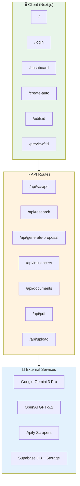
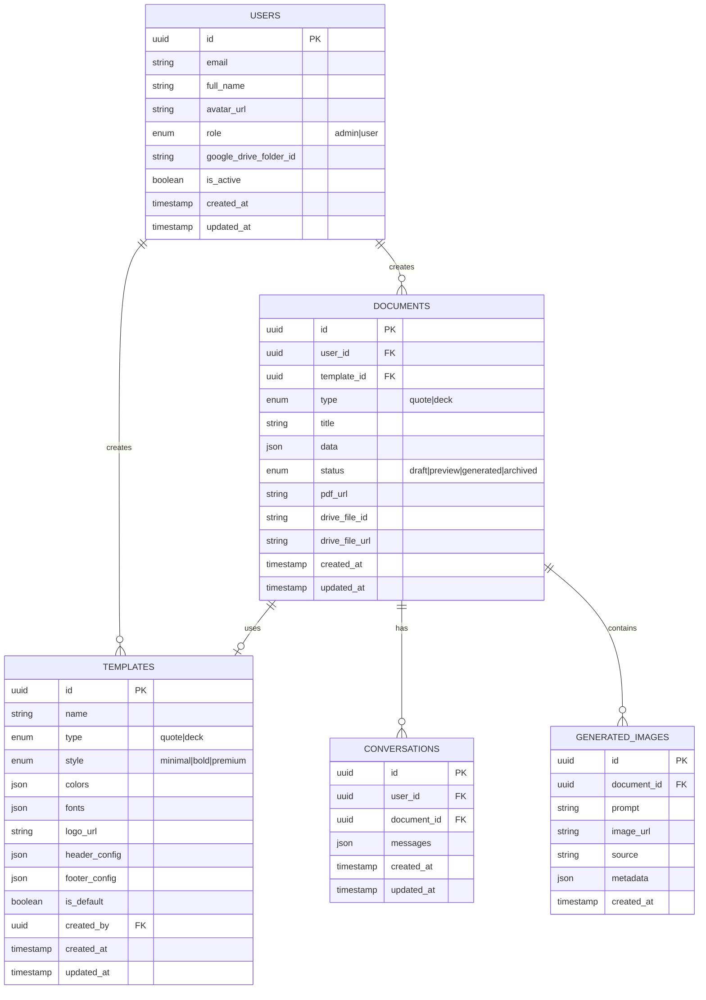
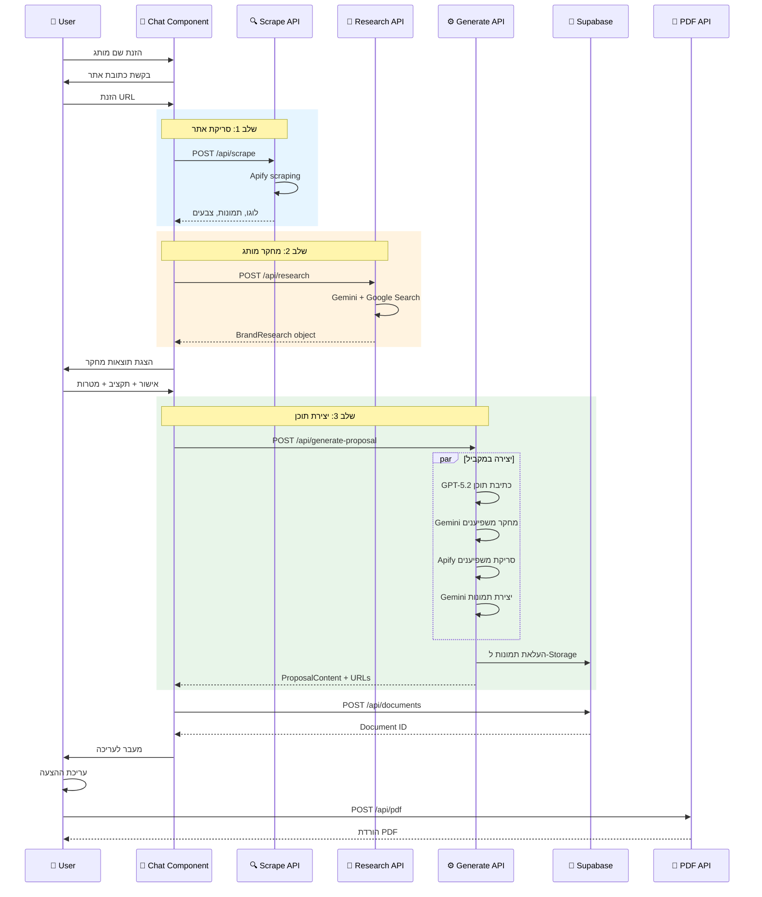
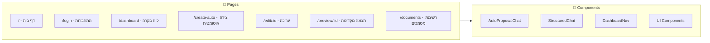
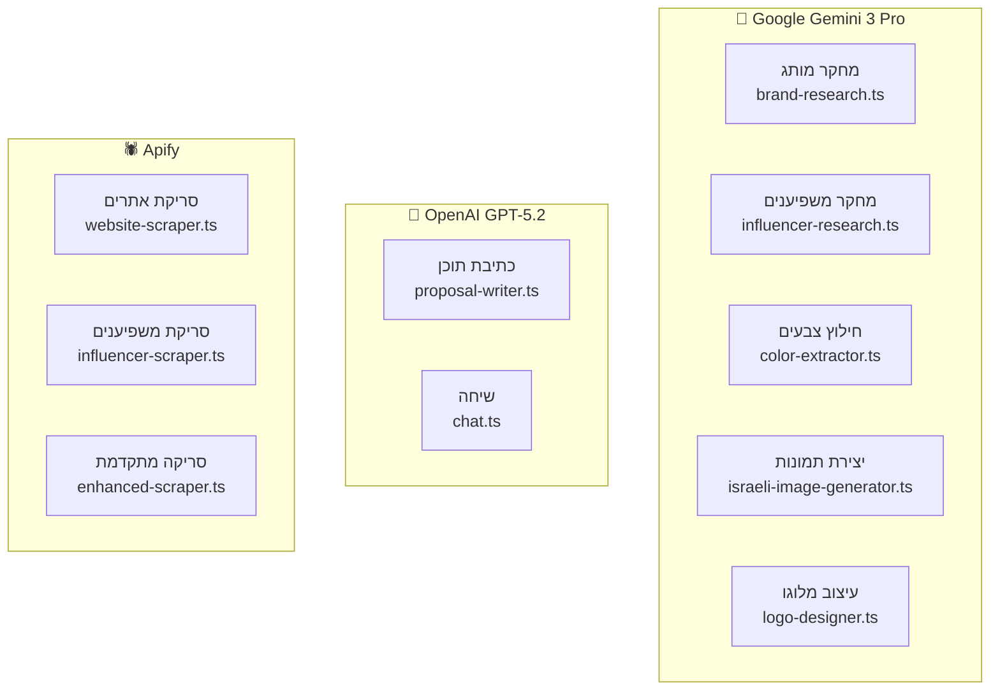
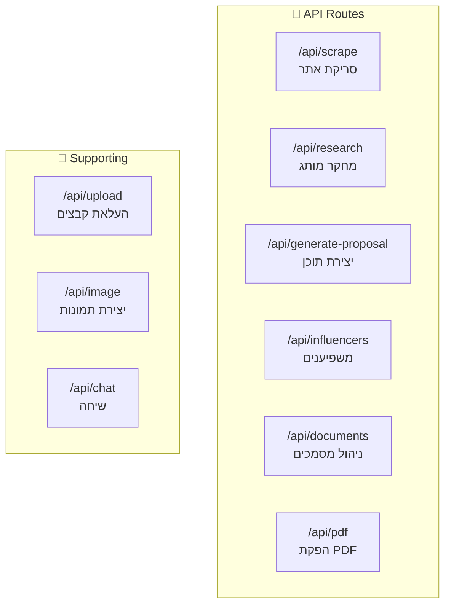
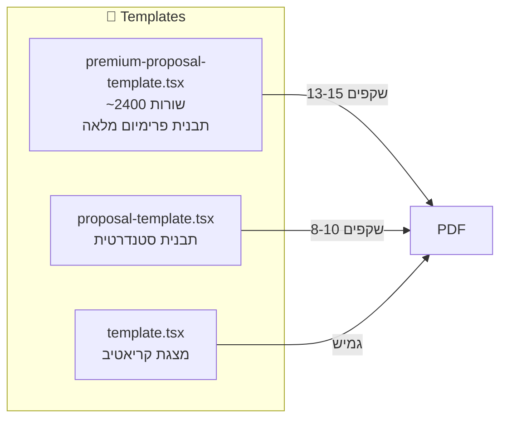
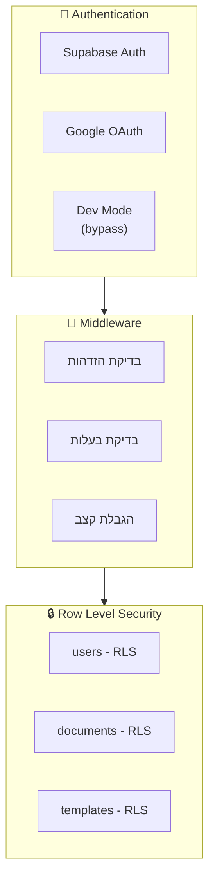
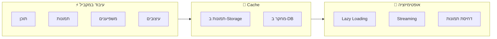

# 📋 אפיון מערכת DocMaker - Leaders

## 🎯 סקירה כללית

**DocMaker** היא מערכת אוטומטית ליצירת הצעות מחיר מקצועיות לשיווק משפיענים.
המערכת משתמשת ב-AI לביצוע מחקר מותג מעמיק, יצירת תוכן מותאם, והפקת PDF איכותי.

### טכנולוגיות ליבה
- **Frontend**: Next.js 15 (App Router), React, TypeScript, Tailwind CSS
- **Backend**: Next.js API Routes
- **Database**: Supabase (PostgreSQL)
- **AI Services**: 
  - Gemini 3 Pro (מחקר מותג, משפיענים, תמונות)
  - GPT-5.2 (כתיבת תוכן הצעה)
- **Scraping**: Apify (אתרים, אינסטגרם)
- **PDF**: Playwright (HTML to PDF)
- **Storage**: Supabase Storage

---

## 🏗️ ארכיטקטורת המערכת



---

## 📊 מבנה מסד הנתונים



---

## 🔄 זרימת יצירת הצעת מחיר אוטומטית



---

## 🧩 רכיבי המערכת

### 1. ממשק משתמש (Frontend)



#### דפים עיקריים:
| נתיב | תיאור | קובץ |
|------|--------|------|
| `/` | דף בית עם הסבר על המערכת | `app/page.tsx` |
| `/login` | התחברות עם Google | `app/(auth)/login/page.tsx` |
| `/dashboard` | לוח בקרה - יצירת מסמך חדש | `app/dashboard/page.tsx` |
| `/create-auto` | שיחה אוטומטית ליצירת הצעה | `app/create-auto/page.tsx` |
| `/edit/:id` | עריכת הצעה לפני הפקת PDF | `app/edit/[id]/page.tsx` |
| `/preview/:id` | תצוגה מקדימה והורדת PDF | `app/preview/[id]/page.tsx` |
| `/documents` | רשימת כל המסמכים | `app/documents/page.tsx` |

---

### 2. שירותי AI



#### פירוט שירותים:

##### Gemini Services (`/lib/gemini/`)

| קובץ | תפקיד | Input | Output |
|------|--------|-------|--------|
| `brand-research.ts` | מחקר מותג מעמיק עם Google Search | שם מותג, נתוני אתר | `BrandResearch` object |
| `influencer-research.ts` | המלצות על משפיענים | `BrandResearch`, תקציב, מטרות | `InfluencerStrategy` |
| `color-extractor.ts` | חילוץ צבעי מותג מלוגו | URL של לוגו | `BrandColors` |
| `israeli-image-generator.ts` | יצירת תמונות ישראליות | מחקר מותג, צבעים, תוכן | תמונות כ-Buffer |
| `logo-designer.ts` | יצירת עיצובים מהלוגו | URL לוגו, שם מותג | עיצובים גרפיים |
| `smart-prompt-generator.ts` | יצירת פרומפטים חכמים לתמונות | אסטרטגיה ויזואלית | פרומפטים לתמונות |

##### OpenAI Services (`/lib/openai/`)

| קובץ | תפקיד | Input | Output |
|------|--------|-------|--------|
| `proposal-writer.ts` | כתיבת תוכן הצעה מלאה | `BrandResearch`, תקציב, מטרות | `ProposalContent` |
| `chat.ts` | שיחה אינטראקטיבית | הודעות | תשובות |

##### Apify Services (`/lib/apify/`)

| קובץ | תפקיד | Input | Output |
|------|--------|-------|--------|
| `website-scraper.ts` | סריקת אתר מותג | URL | לוגו, תמונות, צבעים, תוכן |
| `influencer-scraper.ts` | סריקת פרופילי אינסטגרם | שמות משתמש | `ScrapedInfluencer[]` |
| `enhanced-scraper.ts` | סריקה מתקדמת עם screenshot | URL | צילום מסך, כל הנתונים |

---

### 3. API Routes



#### פירוט API Routes:

| Route | Method | תיאור | Input | Output |
|-------|--------|--------|-------|--------|
| `/api/scrape` | POST | סריקת אתר מותג | `{ url, enhanced? }` | תמונות, צבעים, לוגו |
| `/api/research` | POST | מחקר מותג מעמיק | `{ brandName, websiteData }` | `BrandResearch` |
| `/api/generate-proposal` | POST | יצירת תוכן הצעה מלאה | `{ brandResearch, brandColors, budget, goals }` | `ProposalContent`, תמונות, משפיענים |
| `/api/influencers` | POST | חיפוש וסריקת משפיענים | `{ brandResearch, budget, goals, mode }` | `InfluencerStrategy`, נתונים אמיתיים |
| `/api/documents` | GET/POST | ניהול מסמכים | מסמך חדש או שליפה | רשימת מסמכים |
| `/api/documents/:id` | GET/PATCH/DELETE | מסמך ספציפי | עדכונים | מסמך מעודכן |
| `/api/pdf` | POST | הפקת PDF | `{ documentId, action }` | קובץ PDF |
| `/api/upload` | POST | העלאת קבצים | FormData | URL |

---

### 4. תבניות (Templates)



#### תבנית Premium - מבנה שקפים:

| # | שם השקף | תוכן |
|---|---------|------|
| 1 | Cover | שם המותג + כותרת קמפיין |
| 2 | Brief | למה הם פנו אלינו? נקודות כאב |
| 3 | Goals | מטרות הקמפיין (עד 4) |
| 4 | About Brand | תיאור המותג + לוגו + תמונה |
| 5 | Target Audience | קהל יעד + דמוגרפיה + תובנות |
| 6 | Key Insight | התובנה המרכזית + תמונה |
| 7 | Strategy | אסטרטגיה + עמודי תווך |
| 8 | Activity | הרעיון הגדול + גישות |
| 9 | Deliverables | תוצרים + כמויות |
| 10 | Metrics | תקציב + KPIs + מספרים |
| 11 | Criteria | קריטריונים לבחירת משפיענים |
| 12 | Influencers | המלצות משפיענים (עד 6) |
| 13 | Timeline | לוח זמנים + שלבים |
| 14 | Next Steps | צעדים הבאים + CTA |

---

## 📦 מבני נתונים עיקריים

### BrandResearch
```typescript
interface BrandResearch {
  // Basic Info
  brandName: string
  officialName: string
  tagline?: string
  industry: string
  website: string
  
  // Company Overview
  companyDescription: string // 3-5 פסקאות
  historyHighlights: string[]
  
  // Market Position
  marketPosition: string
  competitors: { name: string; description: string; differentiator: string }[]
  uniqueSellingPoints: string[]
  
  // Products
  mainProducts: { name: string; description: string; targetMarket?: string }[]
  pricePositioning: 'budget' | 'mid-range' | 'premium' | 'luxury'
  
  // Target Audience
  targetDemographics: {
    primaryAudience: {
      gender: string
      ageRange: string
      socioeconomic: string
      lifestyle: string
      interests: string[]
      painPoints: string[]
    }
    behavior: string
    purchaseDrivers: string[]
  }
  
  // Brand Identity
  brandPersonality: string[]
  brandValues: string[]
  toneOfVoice: string
  visualIdentity: {
    primaryColors: string[]
    style: string
    moodKeywords: string[]
  }
  
  // Social & Marketing
  socialPresence: {
    instagram?: { handle?: string; followers?: string }
    facebook?: { followers?: string }
    tiktok?: { handle?: string }
  }
  previousCampaigns: { name: string; description: string }[]
  suggestedApproach: string
  
  // Sources
  sources: { title: string; url: string }[]
  confidence: 'high' | 'medium' | 'low'
}
```

### ProposalContent
```typescript
interface ProposalContent {
  // Cover
  campaignName: string
  campaignSubtitle: string
  
  // Brief
  brandBrief: string
  brandPainPoints: string[]
  brandObjective: string
  
  // Goals
  goals: { title: string; description: string }[]
  
  // Target Audience
  targetAudience: {
    primary: { gender: string; ageRange: string; description: string }
    behavior: string
    insights: string[]
  }
  
  // Strategy
  keyInsight: string
  strategyHeadline: string
  strategyPillars: { title: string; description: string }[]
  
  // Activity
  activityTitle: string
  activityConcept: string
  activityApproach: { title: string; description: string }[]
  
  // Deliverables
  deliverables: { type: string; quantity: number; description: string; purpose: string }[]
  
  // Metrics
  metrics: {
    budget: number
    currency: string
    potentialReach: number
    potentialEngagement: number
    cpe: number
    cpm: number
  }
  
  // Influencers
  influencerStrategy: string
  influencerCriteria: string[]
  
  // Closing
  closingStatement: string
  nextSteps: string[]
}
```

### ScrapedInfluencer
```typescript
interface ScrapedInfluencer {
  username: string
  fullName: string
  profileUrl: string
  profilePicUrl: string
  bio: string
  
  // Stats
  followers: number
  following: number
  posts: number
  
  // Engagement
  avgLikes: number
  avgComments: number
  engagementRate: number
  
  // Content
  recentPosts: {
    imageUrl: string
    caption: string
    likes: number
    comments: number
  }[]
  
  // Categories
  categories: string[]
  hashtags: string[]
  
  // Contact
  email?: string
  isVerified: boolean
  isBusinessAccount: boolean
}
```

---

## 🔄 זרימת נתונים מפורטת

```mermaid
flowchart TB
    subgraph Input["📥 קלט מהמשתמש"]
        BrandName["שם מותג"]
        WebsiteURL["כתובת אתר"]
        Budget["תקציב"]
        Goals["מטרות"]
    end
    
    subgraph Scraping["🔍 שלב 1: סריקה"]
        WebScrape["סריקת אתר"]
        ExtractLogo["חילוץ לוגו"]
        ExtractImages["חילוץ תמונות"]
        ExtractColors["חילוץ צבעים"]
    end
    
    subgraph Research["🔬 שלב 2: מחקר"]
        BrandResearch["מחקר מותג מעמיק"]
        ColorAnalysis["ניתוח צבעים"]
    end
    
    subgraph Generation["⚙️ שלב 3: יצירה"]
        ContentGen["יצירת תוכן"]
        InfluencerGen["מחקר משפיענים"]
        ImageGen["יצירת תמונות"]
        InfluencerScrape["סריקת פרופילים"]
    end
    
    subgraph Assembly["📦 שלב 4: הרכבה"]
        MergeData["איחוד נתונים"]
        SaveToDB["שמירה ל-DB"]
        UploadImages["העלאת תמונות"]
    end
    
    subgraph Output["📤 פלט"]
        EditPage["דף עריכה"]
        PDFGeneration["הפקת PDF"]
        Download["הורדה"]
    end
    
    Input --> Scraping
    Scraping --> Research
    Research --> Generation
    Generation --> Assembly
    Assembly --> Output
```



---

## 🛡️ אבטחה והרשאות



### הרשאות:
- **Users**: יכולים לראות/לערוך רק מסמכים שלהם
- **Admins**: גישה לכל המסמכים ותבניות
- **Dev Mode**: עוקף אימות לפיתוח מקומי

---

## 📁 מבנה תיקיות

```
src/
├── app/                          # Next.js App Router
│   ├── (auth)/                   # דפי אימות
│   │   └── login/
│   ├── admin/                    # ממשק מנהל
│   │   └── templates/
│   ├── api/                      # API Routes
│   │   ├── auth/
│   │   ├── chat/
│   │   ├── documents/
│   │   ├── generate-proposal/
│   │   ├── image/
│   │   ├── influencers/
│   │   ├── pdf/
│   │   ├── research/
│   │   ├── scrape/
│   │   └── upload/
│   ├── create/                   # יצירה ידנית
│   ├── create-auto/              # יצירה אוטומטית
│   ├── dashboard/
│   ├── documents/
│   ├── edit/
│   └── preview/
├── components/                   # קומפוננטות React
│   ├── chat/
│   ├── layout/
│   └── ui/
├── lib/                          # לוגיקה עסקית
│   ├── apify/                    # סריקה
│   ├── auth/                     # אימות
│   ├── gemini/                   # AI Services
│   ├── google-drive/
│   ├── openai/                   # GPT Services
│   ├── playwright/               # PDF
│   ├── schemas/
│   ├── supabase/
│   └── utils/
├── templates/                    # תבניות HTML
│   ├── deck/
│   └── quote/
└── types/                        # TypeScript Types
```

---

## ⚡ ביצועים ואופטימיזציה



### אסטרטגיות:
1. **עיבוד במקביל**: תוכן, תמונות, ומשפיענים מיוצרים במקביל
2. **העלאה ישירה**: תמונות עולות ל-Storage מהשרת (לא דרך הלקוח)
3. **URLs במקום Base64**: התמונות נשמרות ב-Storage ונשלחות כ-URLs

---

## 📋 סיכום טכני

| קטגוריה | טכנולוגיה | שימוש |
|---------|-----------|-------|
| Framework | Next.js 15 | App Router, Server Components |
| Language | TypeScript | טיפוסים מוגדרים לכל המערכת |
| Styling | Tailwind CSS | עיצוב responsive ומודרני |
| Database | Supabase PostgreSQL | אחסון מסמכים, משתמשים, שיחות |
| Storage | Supabase Storage | תמונות, לוגואים, PDFs |
| Auth | Supabase Auth + Google | התחברות מאובטחת |
| AI Content | GPT-5.2 | כתיבת תוכן הצעות |
| AI Research | Gemini 3 Pro + Google Search | מחקר מותג מעמיק |
| AI Images | Gemini Imagen | יצירת תמונות ישראליות |
| Scraping | Apify | סריקת אתרים ואינסטגרם |
| PDF | Playwright | HTML to PDF באיכות גבוהה |

---

## 🔗 קישורים לקבצים מרכזיים

- **Auto Chat**: `src/components/chat/auto-proposal-chat.tsx`
- **Generate API**: `src/app/api/generate-proposal/route.ts`
- **Brand Research**: `src/lib/gemini/brand-research.ts`
- **Proposal Writer**: `src/lib/openai/proposal-writer.ts`
- **Image Generator**: `src/lib/gemini/israeli-image-generator.ts`
- **Influencer Scraper**: `src/lib/apify/influencer-scraper.ts`
- **Premium Template**: `src/templates/quote/premium-proposal-template.tsx`
- **PDF Generator**: `src/lib/playwright/pdf.ts`
- **Database Types**: `src/types/database.ts`

